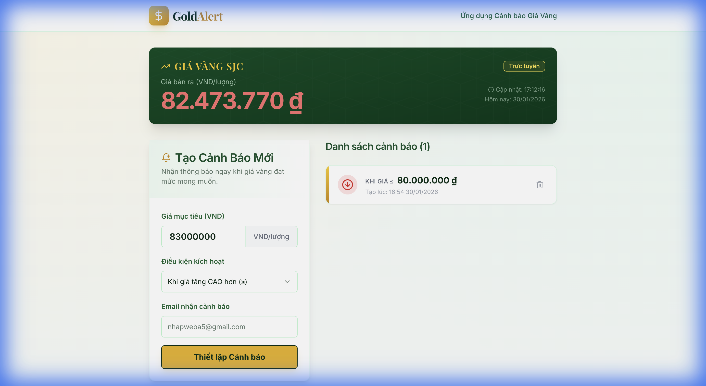

# GoldAlert - Ứng Dụng Cảnh Báo Giá Vàng SJC



## 📖 Giới Thiệu
**GoldAlert** là một ứng dụng web hiện đại giúp người dùng theo dõi giá vàng SJC theo thời gian thực và nhận thông báo qua Email khi giá vàng đạt đến mức mục tiêu mong muốn. Ứng dụng được xây dựng với kiến trúc Frontend-Backend tách biệt, đảm bảo hiệu suất và khả năng mở rộng.

## ✨ Tính Năng Chính
- **Xem Giá Vàng Thời Gian Thực**: Tự động cập nhật giá vàng SJC từ nguồn chính thống.
- **Thiết Lập Cảnh Báo Thông Minh**:
  - Chọn điều kiện: *Giá lớn hơn* hoặc *Giá nhỏ hơn* mức mục tiêu.
  - Nhập giá mục tiêu (VND).
  - **Mới**: Hỗ trợ nhập Email cá nhân để nhận cảnh báo riêng.
- **Gửi Email Tự Động**: Hệ thống Backend tự động gửi email thông báo ngay khi giá vàng khớp với điều kiện.
- **Giao Diện Hiện Đại (Responsive)**: Thiết kế đẹp mắt, thân thiện, hoạt động tốt trên cả máy tính và điện thoại.

## 🛠️ Công Nghệ Sử Dụng

### Backend (.NET 9 Web API)
- **Framework**: ASP.NET Core Web API (.NET 9).
- **Architecture**: Service-Repository Pattern.
- **Features**:
  - `HttpClient` để crawl dữ liệu giá vàng (XML Parsing).
  - Background Service (`GoldMonitorService`) chạy ngầm để giám sát giá liên tục.
  - `MailKit` / `SMTP` để gửi email cảnh báo.
  - Swagger UI để test API trực quan.

### Frontend (React + Vite)
- **Core**: React 18, TypeScript, Vite.
- **UI Library**: Tailwind CSS, Shadcn/UI (Radix Primitives).
- **Icons**: Lucide React.
- **State Management**: React Query (TanStack Query) & React Hook Form.

## 🚀 Hướng Dẫn Cài Đặt & Chạy Ứng Dụng

### 1. Yêu Cầu Hệ Thống
- **.NET SDK 9.0** trở lên.
- **Node.js** (v18 trở lên).
- **Git**.

### 2. Cài Đặt
Clone mã nguồn về máy:
```bash
git clone https://github.com/QuocVinhTrinhLam/Gold-Alert-App.git
cd Gold-Alert-App
```

### 3. Chạy Backend (API)
Mở terminal tại thư mục gốc và chạy lệnh:
```bash
cd GoldAlertApi
dotnet restore
dotnet run
```
*Backend sẽ chạy tại: `http://localhost:5000`*

> **Lưu ý**: Để chức năng gửi mail hoạt động, bạn cần cấu hình SMTP trong `appsettings.json` (hoặc sử dụng User Secrets).

### 4. Chạy Frontend (Web App)
Mở một terminal mới:
```bash
cd GoldAlertClient
npm install  # Cài đặt thư viện (chỉ cần chạy lần đầu)
npm run dev
```
*Frontend sẽ chạy tại: `http://localhost:5173`*

## 📝 Demo Sử Dụng
1. Mở web tại `http://localhost:5173`.
2. Nhập **Giá mục tiêu** (ví dụ: 80,000,000).
3. Chọn điều kiện (ví dụ: Khi giá giảm).
4. Nhập **Email** của bạn để nhận tin.
5. Nhấn **"Thiết lập Cảnh báo"**.
6. Khi giá vàng thị trường chạm mức bạn cài đặt, bạn sẽ nhận được email ngay lập tức!

---
*Dự án được phát triển bởi [Tên Của Bạn]*